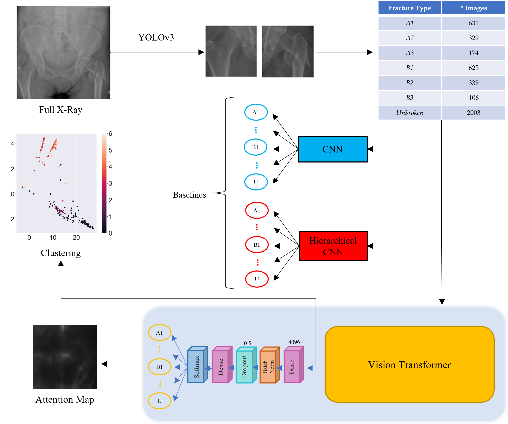

Implementation of a software to recognize and classify bones fractures with a Vision Transformer. Following the classification outlined by the AO Foundation, we developed a method able to discern among different types of fractures and sub-fractures of the proximal femur. This work is carried out and tested in collaboration with the Turin's CTO (Traumatology Orthopedic Center) and the KTH University of Stockholm.

The main pipeline of this work is shown below:

