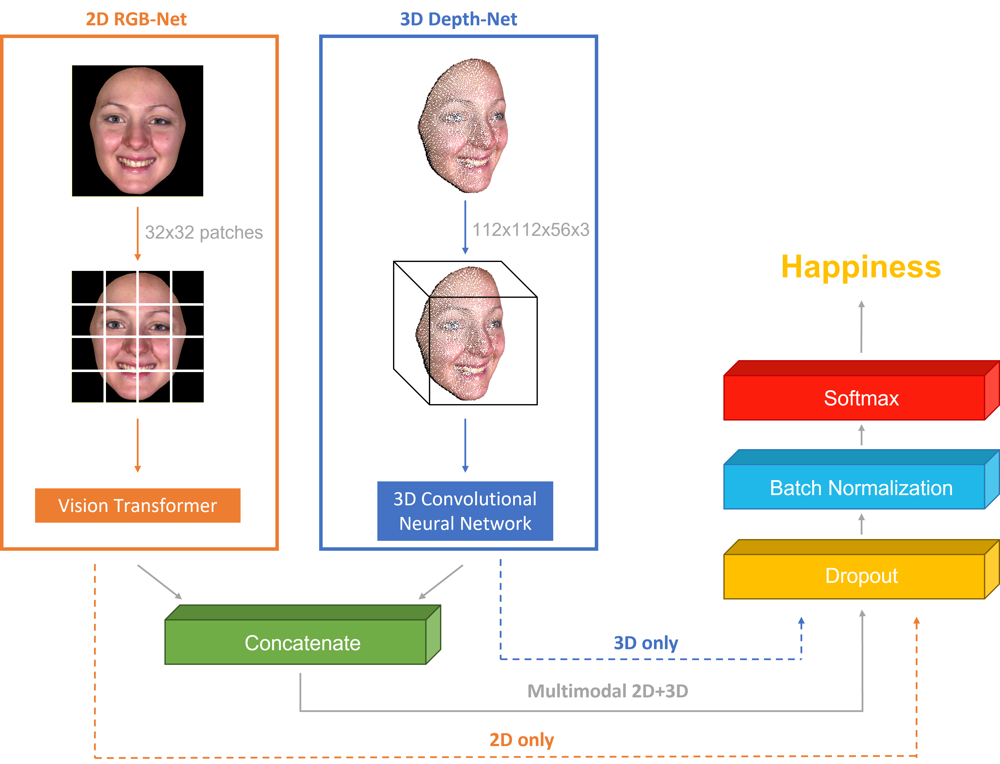

In this work, we developed a multimodal neural network to classify the 7 basic emotions. The idea is to leverage both 3D and 2D data with two different branches. The 3D one is a VGG-like network working with 3D convolution, which takes in input the point cloud obtained from the depth camera. The 2D branch is based on a Vision Transformer. Finally, we also introduced a new dataset, CALD3R, for spontaneous emotion classification. This work was done in collaboration with Polytechnic University of Milan. 

