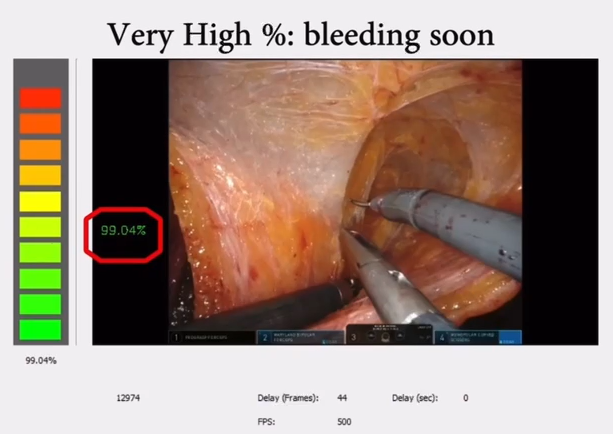

# Computer Assisted Maxillofacial Surgery

Implementation of a Deep Learning based application to assist specialists in surgery pre-planning. As a first step, we are implementing an algorithm that could classify a person into three classes: Mandibular Prognathism, Mandibular Progenism, and Mandibular Laterodeviation. The particularity of this work is that it is trained of different view of the patient (frontal, lateral, ¾) but should return a prediction given just one of the three views, in order to be used in everyday clinical routine. This work is being carried out in collaboration with the Maxillofacial unity of the Molinette Hospital, in Turin – Italy.

# Surgical Video Stream Event Predictor

After defining the concept of the Intelligent Operating Room in a [literature review paper](https://onlinelibrary.wiley.com/doi/10.1002/rcs.2136), we start to implement this conceptualization by implementing an event predictor which can detect anomalies together with giving spatial information to the surgeon. 
We started our work focusing on the blood accumulation problem. We trained a CNN-LSTM to predict the moment when the cavity is filled with blood and it is required intervention from the surgeon. In parallel, the same network is also trained for the segmentation and localization of different objects. This work is carried out with the Urology unity of the San Luigi Hospital, in Orbassano (To) – Italy.

