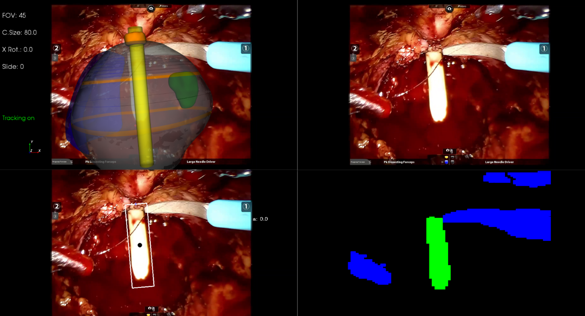
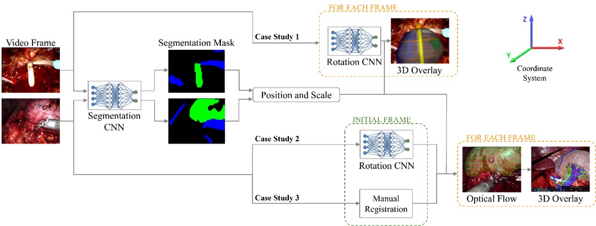

Implementation of a Deep Learning based application to segment the endoscopic video stream during real-time prostatectomy. In the fifth phase of this procedure, the biopsy, it is crucial to locale the area where the tumor was before the removal of the prostate. In a [former work](https://link.springer.com/article/10.1007/s11548-021-02432-y), the catheter is located through a segmentation network and used as an anchor, and the 3D model is attached to the 2D stream of the Da Vinci robot to help the surgeon locate the correct area. 

In a [second work](https://onlinelibrary.wiley.com/doi/10.1002/rcs.2387), we extended this to other phases where the catheter is not present and the organs as to be used as targets. In this paper, we discussed our results with the prostate and the kidney, proposing a second step based on a CNN to predict the rotation of the organ on the three axes and subsequently track the organ with optical flow. 

This work is being carried out and tested during in-vivo surgery in collaboration with the Urology unity of the San Luigi Hospital, in Orbassano (To) – Italy.
