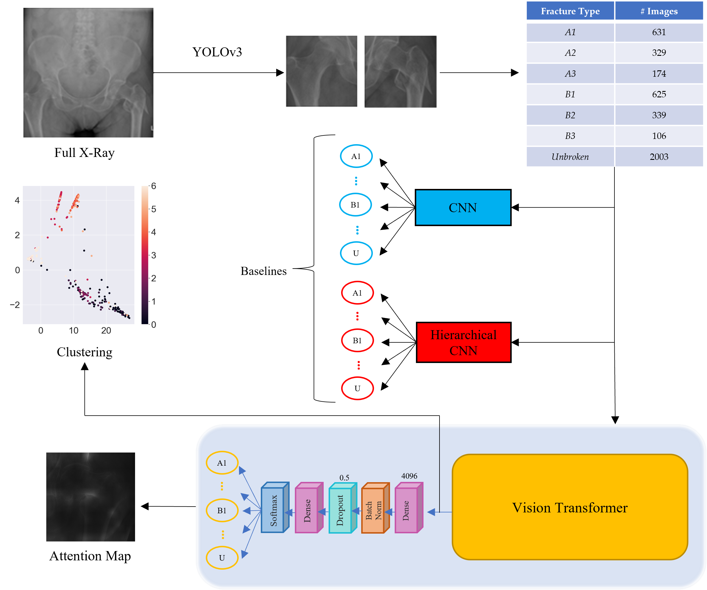

After a deep [literature review](https://doi.org/10.3390/app10041507){:target="_blank" rel="noopener"}, we implemented a software to recognize and classify bones fractures with a Vision Transformer. Following the classification outlined by the AO Foundation, we developed a method able to discern among different types of fractures and sub-fractures of the proximal femur. This work is carried out and tested in collaboration with the Turin's CTO (Traumatology Orthopedic Center) and the KTH University of Stockholm.

The main pipeline of this work is shown below:

The full images are passed to a YOLOv3 network which extracts the left and right femur heads. After the dataset is ready, two baselines were implemented to compare our proposed approach. The first one is a flat classifier, while the second one is a cascade of different classifiers specialized in specific layer of the hierarchy. These two approaches were extensively tested in a [previous paper](https://pubmed.ncbi.nlm.nih.gov/33126175/){:target="_blank" rel="noopener"}.
Then, the ViT was tested and an evaluation of its performance where visualized through attention maps and clustering. Finally, an practical evaluation made by 11 specialist was carried on to demonstrate the effectiveness of this approach. The full paper is available [here](https://pubmed.ncbi.nlm.nih.gov/35469638/){:target="_blank" rel="noopener"}.
